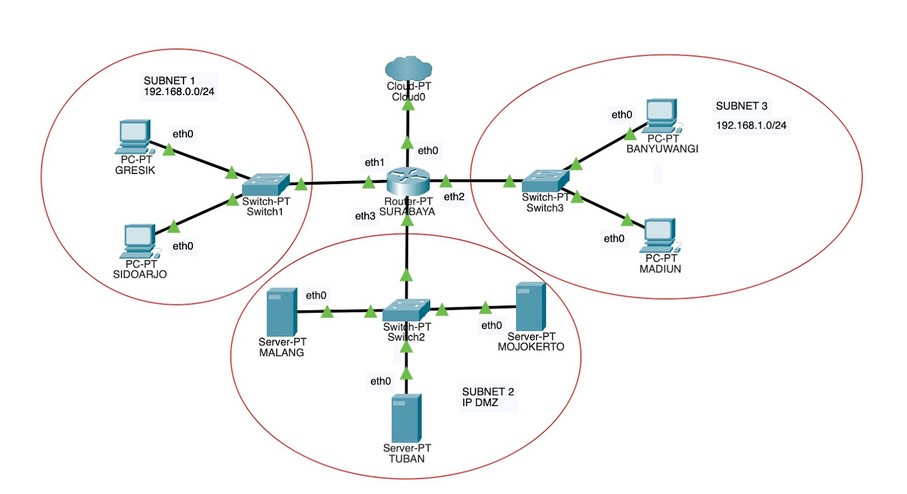

# Jarkom_Modul3_Lapres_B04
Kelompok B04
- Syubban Fakhriya  05111840000042
- Feraldy Nathanael 05111840000166

## Soal 1
Anri adalah seorang mahasiswa tingkat akhir yang seadang mengerhakan TA mengenau DHCP dan Proxy. By Meguri sebagai dosen pembimbing Andri memberikan tugas pertamanya, **(1)** yaitu untuk **membuat topologi jaringan** demi kelancaran TA-nya dengan kriteria sebagai berikut:



Anri sudah pernah mempelajari teknik Jaringan Komputer sehingga Anri dapat membuat topologi
tersebut dengan mudah. Bu Meguri memerintahkan Anri untuk menjadikan SURABAYA sebagai
router, MALANG sebagai DNS Server, TUBAN sebagai DHCP server, serta MOJOKERTO sebagai Proxy
server, dan UML lainnya sebagai client.
Bu Meguri berpesan pada Anri untuk menyusun topologi secara hati-hati dan memperhatikan
gambar topologi yang diberikan Bu Meguri.
Karena TUBAN jauh dari client, maka perlu adanya perantara agar bisa saling terhubung.

### Jawaban soal 1
Untuk soal 1 topologinya sebagai berikut :


## Soal 2
**(2) SURABAYA** ditunjuk sebagai perantara **(DHCP Relay)** antara DHCP Server dan client. 

### Jawaban soal 2

## Soal 3
Kriteria lain yang diminta Bu Meguri pada topologi jaringan tersebut adalah:

1. Seluruh client **TIDAK DIPERBOLEHKAN** menggunakan konfigurasi IP Statis.
   
2. **(3)** Client pada subnet 1 mendapatkan range IP dari 192.168.0.100 dan 192.168.0.110 sampai 192.168.0.200.

### Jawaban soal 3
Supaya client tidak menggunakan konfigurasi IP Statis, maka kita atur pada DHCP Server dan interfacenya di surabaya yaitu :


Kemudian untuk membatasi range ip yang disebar pada subnet 1 (switch 1), maka kita lakukan config dengan perintah berikut (blok perintah pertama) :

```
nano /etc/dhcp/dhcpd.conf
```


Kemudian kita interface pada gresik dan sidoarjo  supaya dinamis seperti berikut :

**Gresik**


**Uji coba gresik**


**Sidoarjo**


**Uji coba sidoarjo**


## Soal 4
3. **(4)** Client pada subnet 3 mendapatkan range IP dari 192.168.1.50 sampai 192.168.1.70.

### Jawaban soal 4
Kemudian untuk membatasi range ip yang disebar pada subnet 3 (switch 3), maka kita lakukan config dengan perintah berikut (blok peritah kedua) :

```
nano /etc/dhcp/dhcpd.conf
```


Kita setting interface pada banyuwangi dan madiun seperti berikut :

**Banyuwangi**


**Uji coba banyuwangi**


**Madiun**


**Uji coba madiun**


## Soal 5
4. **(5)** Client mendapatkan DNS Malang dan DNS 202.46.129.2 dari DHCP

### Jawaban soal 5
Untuk mengatur menambahkan dua DNS tersebut kita tambahkan konfigurasi 
```
option domain-name-servers 10.151.83.42, 202.46.129.2
```


## Soal 6
5. - **(6.1)** Client di subnet 1 mendapatkan peminjaman alamat IP selama 5 menit, sedangkan
   - **(6.2)** client
pada subnet 3 mendapatkan peminjaman IP selama 10 menit.
   

### Jawaban soal 6
Untuk pengaturan peminjaman alamat ip di subnet 1 maka kita atur default-lease-time dan max-lease-time menjadi 300 dan untuk mengatur waktu di subnet 3 maka kita set kedua value tersebut menjadi 600.


## Soal 7
**(7)** User autentikasi
milik Anri memiliki format:
● **User** : userta_yyy
● **Password** : inipassw0rdta_yyy
**Keterangan :** yyy adalah nama kelompok masing-masing. Contoh: **userta_c01**
Anri sudah menjadwal pengerjaan TA-nya
   

### Jawaban soal 7
Pertama kita buat user dan password dengan config seperti berikut :

```
htpasswd -c /etc/squid/passwd userta_b04
```

kemudian kita atur konfigurasi squid menjadi seperti berikut :

```
http_port 8080
visible_hostname mojokerto

auth_param basic program /usr/lib/squid/basic_ncsa_auth /etc/squid/passwd
auth_param basic children 5
auth_param basic realm Proxy
auth_param basic credentialsttl 2 hours
auth_param basic casesensitive on
acl USERS proxy_auth REQUIRED
http_access allow USERS
```


## Soal 8
setiap hari **Selasa-Rabu pukul 13.00-18.00**. Bu Meguri
membatasi penggunaan internet Anri hanya pada jadwal yang telah ditentukan itu saja. Maka diluar jam tersebut, Anri tidak dapat mengakses jaringan internet dengan proxy tersebut. Jadwal bimbingan dengan Bu Meguri adalah


### Jawaban soal 8
Untuk soal ini kita tambahkan 
```
AVAILABLE_WORKING3 time TW 13:00-18:00
```
pada acl.conf di squid seperti berikut


## Soal 9
setiap hari **Selasa-Kamis pukul 21.00 - 09.00** keesokan harinya **(sampai Jumat jam 09.00)**. Agar Anri bisa fokus mengerjakan TA,
   

### Jawaban soal 9
Untuk soal ini kita tambahkan 
```
AVAILABLE_WORKING1 time TWH 21:00-23:59
AVAILABLE_WORKING2 time WHF 00:00-09:00
```
pada acl.conf di squid seperti berikut


## Soal 10
setiap dia **mengakses google.com,maka**
**akan di redirect menuju monta.if.its.ac.id** agar Anri selalu ingat untuk mengerjakan TA 🙂.
   

### Jawaban soal 10
Untuk melakukan redirect kita tambahkan konfigurasi berikut :

```
acl redirect dstdomain google.com
deny_info http://monta.if.its.ac.id/ redirect
http_reply_access deny redirect
```


## Soal 11
Bu Meguri meminta Anri untuk **mengubah error page default squid** menjadi seperti pada soal
   

### Jawaban soal 11


## Soal 12
Karena Bu Meguri dan Anri adalah tipe orang pelupa, maka untuk memudahkan mereka, Anri
memiliki ide ketika menggunakan proxy cukup dengan mengetikkan domain
**janganlupa-ta.yyy.pw** dan memasukkan port **8080**.
   

### Jawaban soal 12
Untuk membuat domain janganlupa-ta.yyy.pw maka kita atur setting pada named.conf.local pada uml malang seperti berikut : 


kemudian tambahkan file janganlupa-ta.b04.pw dengan konfigurasi berikut :


